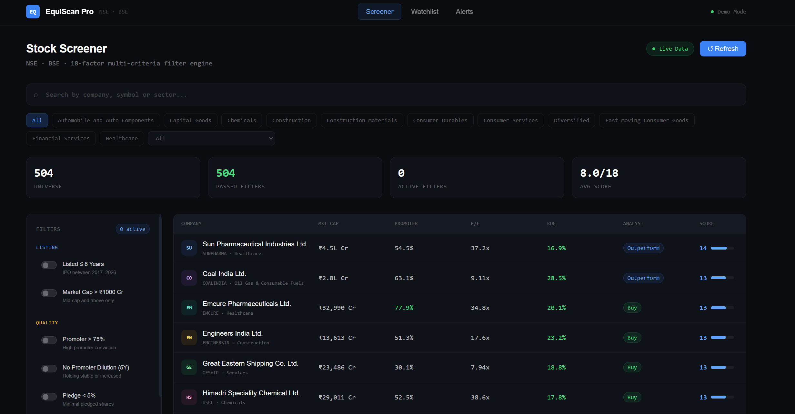

# EquiScan Pro 📊

A production-grade quantitative stock screener for Indian equity markets — 
built with the same analytical framework used by institutional fund managers 
and PMS strategies in India.

> 504 stocks · 19-factor engine · Live data · Built solo

---

## 📸 Screenshots

| Stock Screener | Filters Panel |
|----------------|---------------|
|  |

---

## ✨ Features

**Screener**
- 🔍 19-factor multi-criteria filter engine across 504 NSE/BSE stocks
- 📊 Filters: Listing age, Market cap, Promoter %, Pledge, P/E, ROE, D/E, Revenue growth
- 📈 Technical: 20/50/200 DMA alignment, RSI 40–70, Near 52W High
- 🎯 Analyst consensus: Buy/Outperform filter, recent upgrades, price target upside
- 🏭 Sector filtering across all NSE/BSE sectors

**Stock Detail Page**
- 📉 Interactive price chart (30D / 90D / 180D / 365D)
- 📐 Moving average analysis — DMA visual with bullish/bearish signal
- ⚡ Relative strength vs Nifty 50 (1M / 3M / 6M)
- 🔊 Volume analysis with spike detection (normal / high / extreme)
- 🤖 Quant signal engine — composite Buy/Hold/Sell score
- ✅ All 19 criteria checked per stock with pass/fail breakdown

**Platform**
- ⭐ Watchlist — save and track shortlisted stocks
- 🔔 Alerts system
- 🔴 Live data pipeline — Kite Connect + Screener.in with daily refresh
- 🌐 Demo mode for presentation without live API keys

---

## 🛠️ Tech Stack

| Layer | Technology |
|-------|-----------|
| Frontend | Next.js, TypeScript, Tailwind CSS, Recharts |
| Backend | Python |
| Data APIs | Kite Connect (Zerodha), Screener.in, Trendlyne, Tickertape |
| Database | PostgreSQL |
| Charts | Recharts |

---

## 📁 Project Structure

```
backend/
├── fetchers/         # Kite, NSE, Screener, Quant, Trendlyne fetchers
├── main.py           # FastAPI server
├── scheduler.py      # Daily data refresh
├── quant.py          # Signal generation engine
└── requirements.txt

frontend/
├── app/
│   ├── screener/     # Main screener page
│   ├── stock/[symbol]/ # Detailed stock page
│   ├── watchlist/    # Saved stocks
│   └── alerts/       # Price alerts
├── components/
│   ├── FilterPanel.tsx   # 19-factor filter UI
│   ├── StockTable.tsx    # Results table
│   └── Navbar.tsx
└── lib/
    ├── screenerEngine.ts # Filter logic
    ├── stockData.ts      # Demo data
    └── watchlist.ts      # Watchlist state
```

---

## 🚀 Running Locally

```bash
# Backend
cd backend
pip install -r requirements.txt
python main.py

# Frontend (new terminal)
cd frontend
npm install
npm run dev
```

Add your API keys to `.env`:
```
KITE_API_KEY=
KITE_API_SECRET=
KITE_ACCESS_TOKEN=
SCREENER_SESSION=
DATABASE_URL=
```

---

## 👤 Built By

**Kanak Suryavanshi** — [@kanak3024](https://github.com/kanak3024)  
🌐 [thriftgennie.com](https://thriftgennie.com)
